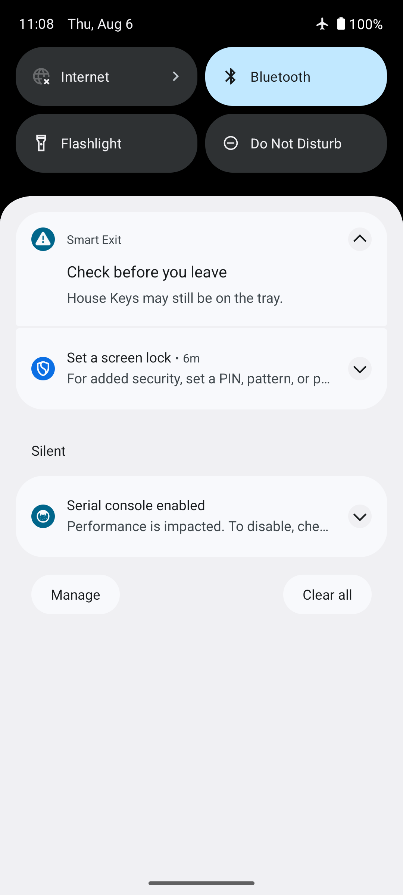
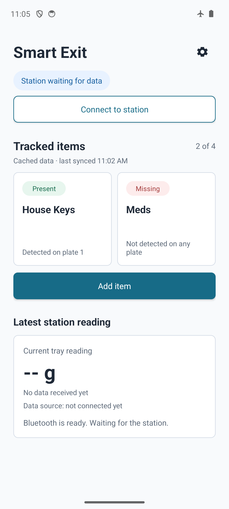

# Forgotten-Item Notification Tests

| Case | Expected | Actual | Result |
| --- | --- | --- | --- |
| Notification permission denied | No reminder is posted | Delivery rule returns false when permission is missing | Pass |
| No items remain on the station | No reminder is posted | Empty snapshots do not request a notification | Pass |
| One item remains | One reminder is requested with that item | Snapshot contains the single present item and delivery is allowed | Pass |
| Several items remain | One reminder is requested with all present items | Snapshot preserves every present item and delivery is allowed | Pass |
| Notification is tapped | App opens the saved disconnect snapshot | Notification launch selects cached data, including after a cold start | Pass |
| Disconnect callback repeats | Only the first callback creates a snapshot | Further callbacks are ignored until the station reconnects | Pass |

Automated with `DisconnectNotifierTest`, `DisconnectEventCoordinatorTest`, and
`DashboardSnapshotSelectorTest`. The notification and cached-dashboard screens
were also checked on the Android emulator.

